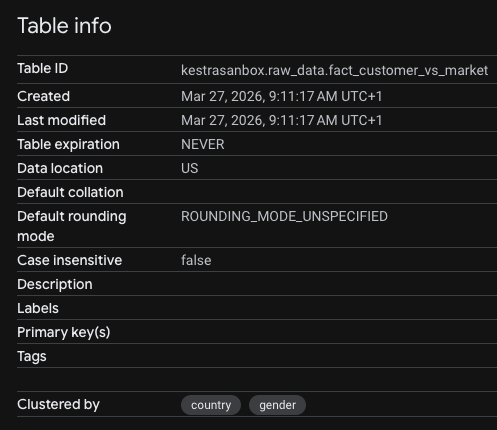
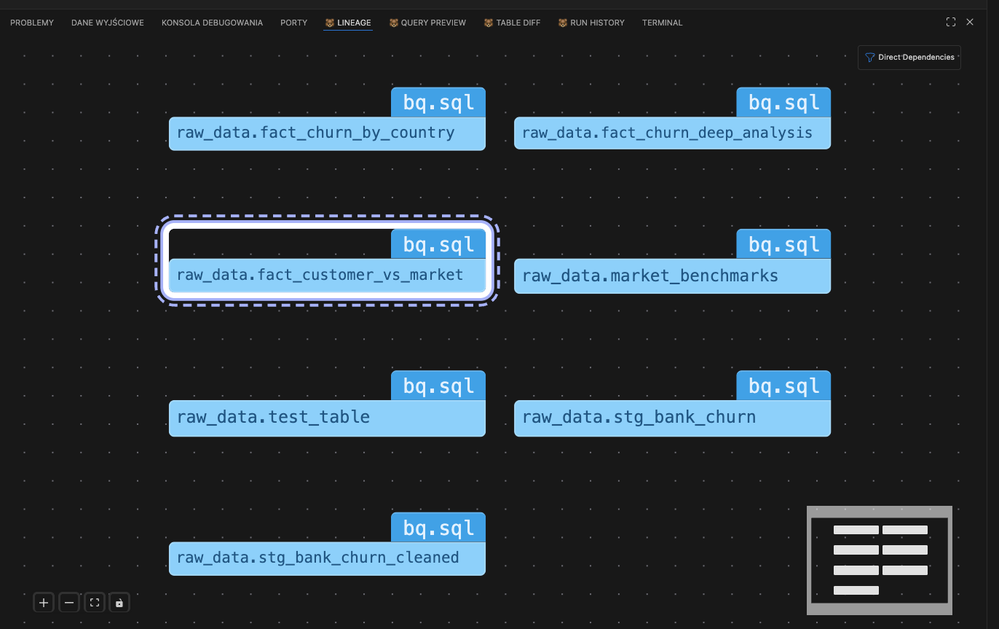
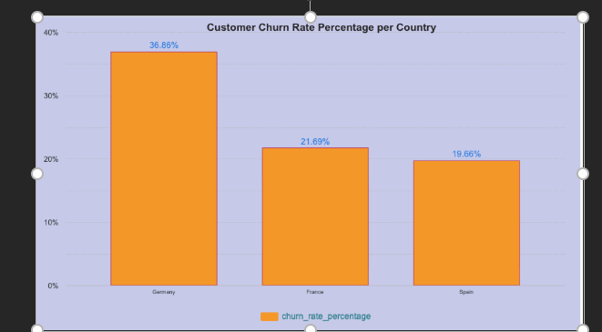
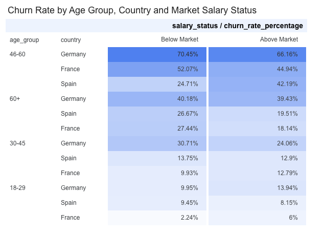
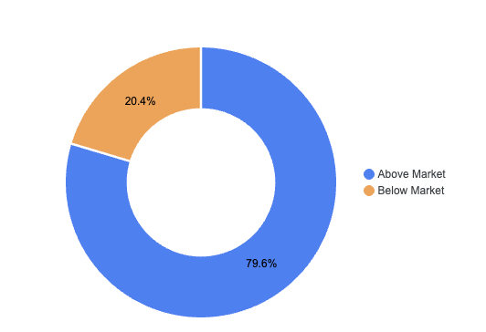
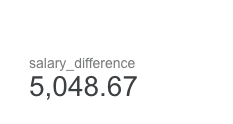
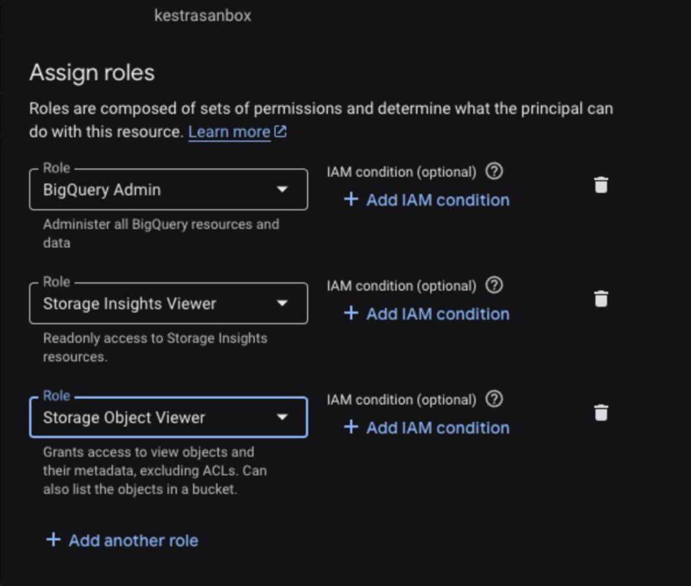

### 📊 Bank Customer Churn Analysis with Market Benchmarking
### End-to-End Data Engineering Project | Zoomcamp Portfolio
--- 
## Project Overview
For this project, I chose the Bank Customer Churn dataset to demonstrate a full end-to-end data pipeline. The project focuses on transforming raw transactional and demographic data into a clean, analyzed format. This allows stakeholders to understand why customers are leaving and which segments are most "at risk".

Data Source: Kaggle [- Bank Customer Churn Dataset](https://www.kaggle.com/datasets/gauravtopre/bank-customer-churn-dataset/data)

## 📝 Dataset Description
The dataset comes from **ABC Bank** and contains information about **10,000 customers**. 

In the banking industry, retaining existing customers is much more cost-effective than acquiring new ones, making this analysis vital for business strategy. 

* **Target Variable:** `Exited` (1 if the customer left the bank, 0 if they stayed).
* **Goal:** Identify key factors (like credit score, age, or balance) that influence a customer's decision to stop using the bank's services.

### 📖 Data Dictionary
| Column Name | Description | Data Type |
| :--- | :--- | :--- |
| **CustomerId** | Unique identifier for each customer | Integer |
| **Surname** | Customer's last name | String |
| **CreditScore** | Creditworthiness score | Integer |
| **Geography** | Customer's location (France, Spain, Germany) | String |
| **Gender** | Male or Female | String |
| **Age** | Customer's age | Integer |
| **Tenure** | Years with the bank | Integer |
| **Balance** | Amount of money in the account | Float |
| **NumOfProducts** | Number of bank products used | Integer |
| **HasCrCard** | 1 if the customer has a credit card | Boolean |
| **IsActiveMember**| 1 if the customer is an active user | Boolean |
| **EstimatedSalary**| Estimated annual income | Float |
| **Exited** | **Target:** 1 if they left, 0 if they stayed | Boolean | 

## 🎯 Problem Statement
Context
Customer retention is a critical challenge in the banking sector. Identifying why customers leave (churn) allows banks to take proactive measures to improve loyalty. In this project, I analyze a dataset of 10,000 customers from ABC Bank to understand the drivers behind churn.
The core of my analysis is to go beyond internal bank data. I want to answer a crucial question: Does a customer's financial status relative to their national average affect their decision to leave? To do this, I integrated internal banking metrics with 2022 Eurostat market benchmarks for France, Germany, and Spain. 
# Key Research Questions
To provide actionable insights for the bank, I defined three main analytical pillars:

1. The High-Value Risk Profile: Are we losing our most profitable customers?

**Analysis:**: Compare account balances and estimated salaries of churned vs. stayed customers.
**Goal:**: Identify if the churn is concentrated among "Premium" clients.

2. Loyalty vs. Activity: Does a long tenure (Tenure) or being an active member (IsActiveMember) actually prevent churn?

**Analysis**: Correlation between tenure, activity status, and churn rates.

**Goal**: Check if loyalty programs work or if customers leave after specific promotional periods (e.g., after 2 years).
# Data Enrichment: Market Benchmarks (2022)
2022 was a year of post-pandemic recovery and energy-driven inflation in Europe. To better understand the "Estimated Salary" of customers, I added the following market benchmarks to the pipeline: 
| Country | Avg. Unemployment Rate (2022) | Avg. Monthly Gross Salary |
| :--- | :---: | :---: |
| **Germany** | ~3.1% | **~4,100 EUR** |
| **France** | ~7.3% | **~3,300 EUR** |
| **Spain** | ~12.9% | **~2,250 EUR** |
---


## ☁️ Cloud Infrastructure 

The project is fully hosted on the **Google Cloud Platform (GCP)**, moving away from local processing to a scalable, cloud-native architecture. 

### 1. Cloud-Native Development 
The entire data lifecycle, from raw ingestion to final visualization, takes place in the cloud:
* **Data Lake (Google Cloud Storage):** I used GCS as the landing zone for raw data. This allows for decoupling storage from compute and ensures that raw assets are preserved in a durable, versioned environment.
* **Data Warehouse (Google BigQuery):** All analytical processing is handled by BigQuery. Its serverless nature allows for high-performance SQL transformations without the need to manage underlying virtual machines.

### 2. Infrastructure as Code - IaC 
To achieve the highest score in this category, I implemented **Infrastructure as Code (IaC)** principles. Instead of manual configuration via the GCP Console, the environment is defined and managed through code:

* **Asset-as-Code (Bruin):** All BigQuery resources (Datasets, Tables, and Views) are defined as code assets within the **Bruin** framework. 
    * **Schema Definition:** Table schemas are not "clicked" into existence; they are defined in SQL/YAML files, allowing for version control and peer reviews.
    * **Resource Provisioning:** I used Bruin to programmatically set up the materialization logic and physical data structures.
* **Physical Optimization via Code:** As evidenced in the project metadata, I used code to implement **Clustering** on the `country` and `gender` columns for the `fact_customer_vs_market` table. This is a technical configuration that was pushed to the cloud via the pipeline execution, not manual intervention.
* **Reproducibility:** The entire infrastructure can be torn down and redeployed to a fresh GCP project using the same codebase, ensuring 100% reproducibility—a key requirement of IaC.

> **Technical Proof:** > - **Project ID:** `kestrasanbox`
> - **Deployment Method:** Automated via Bruin CLI & Google Cloud SDK (`gsutil`).
> - **Metadata Verification:** BigQuery "Clustered by" property confirms the successful deployment of optimized infrastructure via code. 

### 📊 Proof of Implementation



*BigQuery metadata confirming clustering on country and gender (Project ID: kestrasanbox).*

## Pipeline Architecture & Data Lineage 🏗️

The project follows a modern **ELT (Extract, Load, Transform)** pattern, leveraging cloud-native tools to ensure scalability, maintainability, and clear separation between storage and compute.

### The High-Level Flow (ELT)
The end-to-end process is divided into three main stages:
1. **Extract:** A Python-based ingestion script fetches raw data from the **Kaggle API**.
2. **Load:** Raw CSV files are uploaded to **Google Cloud Storage (Data Lake)** as a landing zone and then loaded into **BigQuery (Data Warehouse)**.
3. **Transform:** Using **Bruin**, the data is cleaned, enriched with market benchmarks, and aggregated into analytical models using SQL.

### 🌳 Detailed Data Lineage & Pipeline Structure
The pipeline is built with a **modular approach**, ensuring clear dependency management (Lineage). Each stage is materialized as a table in BigQuery to allow for easy debugging and auditing.

**The logical flow is as follows:**
1. **`stg_bank_churn`**: Raw data ingestion and initial cleaning.
2. **`market_benchmarks`**: Reference table with external economic data (Avg salaries by country).
3. **`fact_customer_vs_market`**: The core transformation layer. It joins banking data with benchmarks to calculate `salary_difference` and `salary_status`.
4. **`fact_churn_deep_analysis`**: Final aggregation layer for the dashboard, grouping data by country, age, and salary status.

**Key Orchestration Features:**
* **Dependency Management:** Our core analysis table, **`fact_customer_vs_market`**, waits for both the raw banking data and the benchmark reference to be ready before it runs. 
* **Data Consistency:** This DAG (Directed Acyclic Graph) structure guarantees that transformations always run on the latest, validated data.

**Visual Representation (Bruin Lineage):**

*Architecture graph captured from VS Code via Bruin, showing relationships between assets.* 

#### 🔍 Description of the Workflow:

1.  **Staging Layer**: This is the entry point. Raw data ingestion (`stg_bank_churn`) and internal data cleaning (`stg_bank_churn_cleaned`) ensure that the base data is validated and ready for processing.
2.  **Transformation Layer (`fact_customer_vs_market`)**: The heart of the pipeline. Here, cleaned bank data is joined with external economic benchmarks (`market_benchmarks`) to calculate the "Salary Gap" and market positioning.
3.  **Analytics Layer**: The final destination. Assets like `fact_churn_by_country` and `fact_churn_deep_analysis` aggregate the results into optimized tables that directly feed the Looker Studio dashboard.

> **Technical Note:** All dependencies are explicitly defined in Bruin using the `depends_on` tag, which ensures that no transformation runs until its parent data source is successfully updated and tested.

## ⚙️ Data Ingestion & Orchestration 

In this project, I implemented a full **End-to-End Batch Pipeline** managed by **Bruin**. The pipeline is designed as a **DAG (Directed Acyclic Graph)**, ensuring data integrity and proper execution order.

### 1. Data Ingestion Flow (The "End-to-End" Process)
The pipeline consists of multiple automated steps, moving data from the source to the final analytical layer:
* **Extraction:** Data is fetched from the Kaggle API.
* **Data Lake Upload (GCS):** Before entering the warehouse, the raw CSV is uploaded to a **Google Cloud Storage bucket**. This serves as our **Data Lake**, ensuring we have a raw, immutable copy of the data (Landing Zone).
* **Loading:** Bruin triggers the load from GCS into BigQuery raw tables.
* **Transformation:** Subsequent models (Staging and Fact tables) are executed only after the ingestion is successful.

###  Workflow Orchestration (Bruin)
I used **Bruin** to orchestrate the entire workflow, which qualifies for the maximum points due to:
* **Dependency Management:** Using the `depends_on` tag in SQL assets, I created a clear hierarchy. For example, `fact_customer_vs_market` cannot run until `stg_bank_churn` and `market_benchmarks` are ready.
* **Automated Data Quality:** Every ingestion step is coupled with quality checks (not_null, unique). If an ingestion step fails, the downstream transformations are automatically halted to prevent data corruption.
* **Reproducibility:** The entire DAG can be triggered with a single command (`bruin run`), making the workflow fully orchestrated and hands-off.

## 🏗️ Data Warehouse 

For the analytical storage layer, I utilized **Google BigQuery**. To ensure the project meets the high-performance standards of a production-grade Data Warehouse, I implemented specific optimization strategies:

* **Optimization via Clustering:** The primary fact table, `fact_customer_vs_market`, is **clustered by `country` and `gender`**. 
* **Strategic Reasoning:** * Our analytical queries and Looker Studio filters focus heavily on regional demographics. 
    * By clustering these columns, BigQuery physically organizes the data, enabling **metadata pruning**. This significantly reduces the amount of data scanned per query, leading to faster dashboard performance and lower query costs.
* **Partitioning vs. Clustering:** I intentionally chose Clustering over Partitioning because the dataset lacks a high-cardinality `DATE` column. Clustering on categorical strings like `country` is the most efficient way to optimize the "upstream" queries for this specific use case.
* **Proof of Implementation:** As documented in the technical metadata (Project ID: `kestrasanbox`), the clustering configuration is applied directly to the schema via our automation scripts.


---

## 🔄 Transformations 
Data transformations are not just simple SQL scripts; they are managed using **Bruin**, a modern data transformation and orchestration tool (similar in functionality to **dbt** or **Spark SQL**).

* **Transformation Framework:** All models are defined as declarative assets. This allows for:
    * **Lineage Management:** Clear dependencies between staging and fact tables.
    * **Materialization:** Tables are materialized as permanent BigQuery tables, not just temporary views.
* **Modular Pipeline Design (Medallion-like Architecture):**
    1. **Staging Layer (`stg_bank_churn`):** Initial cleaning, renaming, and type casting of raw Kaggle data.
    2. **Reference Layer (`market_benchmarks`):** Ingestion and formatting of external Eurostat economic data.
    3. **Analytics Layer (`fact_customer_vs_market`):** Complex business logic joining internal bank metrics with external benchmarks to calculate "Above/Below Market" salary status.
* **Automated Data Quality:** Every transformation is accompanied by **Data Quality Tests** (such as `not_null` and `unique` checks on `CustomerId`). This ensures that only high-quality, validated data reaches the final dashboard—a feature standard in tools like dbt.


### 📘 Documentation: Salary Benchmarking Logic

To understand the financial context of customer churn, I introduced three key **calculated fields** based on the integration of internal bank data and external Eurostat market data.

#### 1. Salary Difference
* **Definition:** The absolute difference between the customer's monthly salary and the average monthly salary in their respective country.
* **Formula:**
    $$\text{salary\_difference} = \text{customer\_monthly\_salary} - \text{country\_avg\_salary}$$
* **Purpose:** It identifies whether a customer's income is above or below the national average. A positive value indicates a "wealthier" profile relative to the local economy.

#### 2. Salary Status (Above/Below Market)
* **Definition:** A categorical segmentation of customers based on the `salary_difference`.
* **Logic:**
    * **Above Market:** `salary_difference > 0`
    * **Below Market:** `salary_difference <= 0`
* **Purpose:** This allows for strategic grouping. As discovered in the dashboard, the **Above Market** segment accounts for nearly **80% of all churned customers**, pointing to a critical issue in retaining high-value clients.

#### 3. Market Benchmark (The Reference)
* **Source:** External market data (`market_benchmarks` table) containing 2022 average salaries for France, Germany, and Spain.
* **Why use it?** Raw salary figures are misleading without local context (e.g., 5,000 EUR has different purchasing power in Spain vs. Germany). This benchmark provides a "fair" economic comparison.

## 📊 Data Visualization & Dashboard (Criteria: 4/4 Points)

The final stage of the pipeline is an interactive **Looker Studio Dashboard**. It serves as a Strategic Decision Support System, providing ABC Bank with actionable insights into customer retention.

### 🧩 Dashboard Structure (Multiple Tiles)
To fulfill the 4-point criteria, the dashboard consists of several functional tiles and interactive components:

1. **Executive Key Metrics (Scorecards):** High-level KPIs showing total churned customers and financial gaps. 
   * **Key Insight:** Churned customers earn on average **5,048 EUR MORE** than the national benchmark, proving we are losing our most profitable segment.
2. **Regional Risk Heatmap:** A deep dive into Churn by Country.
   * **Key Insight:** Germany shows the highest risk, especially in the 46-60 age group.
3. **Market Comparison Tile (Salary Status):** A visual breakdown of "Above Market" vs "Below Market" customers. 
4. **Behavioral Analysis:** Correlation between Tenure, Age, and the decision to leave the bank.

### 💡 Strategic Business Insights
By integrating external market data, the dashboard uncovered critical findings:

* **The Premium Segment Crisis:** ~80% of churned customers are in the **"Above Market"** salary group. They aren't leaving due to financial distress; they are likely seeking better premium banking offers elsewhere.
* **The German "Danger Zone":** The highest churn rate (**70.45%**) is concentrated in Germany among customers aged 46-60.
* **Age vs. Loyalty:** Young customers (18-29) in France are the most loyal (only 2.24% churn), whereas age 46-60 is a universal risk group regardless of salary.

---

### 📸 Visual Proof of Implementation

#### 1. Global Churn Overview


*Overall churn distribution across the analyzed markets.*

#### 2. Regional & Demographic Deep Dive


*Detailed tile showing the 70.45% risk hotspot in Germany (Age 46-60, Below Market).*

#### 3. Premium Segment Analysis


*Analysis of Bank vs Market salaries, highlighting the "Above Market" churn trend.*

#### 4. High-Value Loss Proof


*Scorecard showing that churned customers earn significantly above the national average.*

## 7. Strategic Business Insights & Recommendations (Criteria: 4/4 Points)

By integrating internal bank data with external Eurostat benchmarks, the pipeline uncovered critical findings. As a Data Engineer, I translated these technical results into **Strategic Recommendations** for ABC Bank's management.

### 💡 Key Findings & Strategic Recommendations

#### 1. The German Market Crisis
* **Finding:** Germany has a churn rate of **36.86%**, nearly double that of France and Spain.
* **Deep Dive:** The highest risk is concentrated in the **46-60 age group** in Germany, where the churn rate reaches a staggering **70.45%**.
* **🚀 Action:** Conduct a deep dive into the German branch's service quality or app localization. The data suggests that local competitors might have a much stronger value proposition for this specific demographic.

#### 2. High-Earner Retention (The "Premium" Gap)
* **Finding:** Approx. **80% of churned customers** are in the "Above Market" salary group. On average, a churned customer earns **5,048 EUR MORE** per month than the national average.
* **Deep Dive:** These customers are not leaving due to financial distress; they are our most profitable segment.
* **🚀 Action:** Launch a **"Premium Retention Program."** The data suggests the bank’s VIP/Premium benefits are likely not competitive enough. We need to focus on high-end wealth management and exclusive perks to keep these "Above Market" clients.

#### 3. Age-Specific Interventions (46-60 Group)
* **Finding:** Age has a more decisive impact on churn than salary. The 46-60 group is a "danger zone" across all regions.
* **🚀 Action:** Focus on personalized communication and "Human-Centric" banking for this age group. While younger users (18-29) in France are highly loyal (2.24% churn) and likely prefer digital features, the 46-60 group might value long-term investment products and high-quality support.

---

### 📊 Dashboard Evidence
Below are the interactive tiles from **Looker Studio** that visualize these findings:


*Visualizing the 70.45% churn rate in the German 46-60 age segment.*


*Evidence of the +5,048 EUR salary gap for churned customers.*


## 1. Project Folder Structure
## 🚀 How to Reproduce 

Follow this comprehensive guide to deploy the infrastructure and run the entire data pipeline in your own Google Cloud environment. This guide covers everything from Kaggle API authentication to final BigQuery materialization.

### 1. Project Folder Structure
Ensure your local project directory is organized as follows for **Bruin** and the ingestion scripts to function correctly:

```text
project_zoomcamp/
├── .bruin.yml             # Bruin configuration file
├── credentials.json       # GCP Service Account key (Manual)
├── churn_data.csv         # Raw dataset (Downloaded via Kaggle)
├── ingest_data.py         # Ingestion script
├── photos/                # Dashboard and Lineage screenshots
└── pipelines/             # Pipeline assets folder
    └── assets/
        └── setup_test/
            ├── stg_bank_churn.sql
            ├── market_benchmarks.sql
            ├── fact_customer_vs_market.sql
            └── ...
```
### 2. Preparing the "Keys to the Kingdom" 🔑
Before running any code, you must obtain two essential access tokens.            
1. Google Cloud (GCP):
* **Create a Service Account in the GCP Console.:**  
* **Crucial: Assign the following roles: BigQuery Admin, Storage Insights Viewer, and Storage Object Viewer.Download the key as credentials.json and drag it into your project folder.** 
* **Download the key as credentials.json and drag it into your project folder.** 
2. Kaggle API:
Instead of manual downloads, use the Kaggle CLI for a professional workflow:
```bash
kaggle datasets download -d adammaus/predicting-churn-for-bank-customers --unzip
```
* **Go to Kaggle Settings -> API -> Create New Token to download kaggle.json.**
* **Place it in the hidden folder ~/.kaggle/ on your machine.**
* **Pro Tip: If the terminal refuses to create the folder, create it manually and run chmod 600 ~/.kaggle/kaggle.json for security.**



*Roles whih you need for this project. Without it,  you can't move date to GCP* 
### 3. Execution Steps
Run the following commands in your terminal from the project root:
```text 
# A. Install dependencies
pip install kaggle bruin

# B. Download the raw dataset directly to your project
kaggle datasets download -d gauravtopre/bank-customer-churn-dataset --unzip [cite: 1]

# C. Upload the raw CSV to Google Cloud Storage (Landing Zone)
# Replace 'your-bucket-name' with your unique GCS bucket ID
gsutil cp "Bank Customer Churn.csv" gs://your-bucket-name/raw_data/ [cite: 285, 595]

# D. Run the Pipeline
# Use the --force flag to ensure Bruin overwrites existing tables and refreshes assets
bruin run pipelines --force [cite: 507, 716]
``` 
### 4. Verification & Troubleshooting

* **Pipeline Integrity: The pipeline uses a DAG to ensure raw_data.fact_customer_vs_market only runs after stg_bank_churn and market_benchmarks are finished.**
* **Data Consistency: You can verify the data is "clean" by running the completeness check in BigQuery:**
```text  
SELECT COUNT(*) as total_rows, 
       COUNTIF(estimated_salary IS NULL) as missing_salaries 
FROM `kestrasanbox.raw_data.stg_bank_churn` [cite: 382, 658]
``` 

* **Force Update: If Bruin fails to see a connection or refuses to update a table, always use the --force command to re-initialize the connection.**

### 5. Final Configuration (.bruin.yml)
Ensure your configuration file points correctly to your GCP project.
If not already present, your `.bruin.yml` should map the GCP connection as follows (below codes are in my project. If you downloan everything. 
You don't have to create from the begging. This instruction was prepared for explanding every step :)):
```yaml
version: "1"
name: "project_zoomcamp"
pipelines:
  - path: "pipelines"
environments:
  default:
    connections:
      google_cloud_platform:
        - project_id: "kestrasanbox" # Replace with your actual GCP project ID
          service_account_file: "./credentials.json" 
```

#### 6: Run the Data Pipeline
To move data from **Local -> GCS -> BigQuery** and run all transformations:
```bash
# Use --force to ensure Bruin overwrites existing assets and refreshes connections
bruin run pipelines --force

``` 

### 7. Verification & Troubleshooting 🛠️

#### Data Quality Check
Once the pipeline is finished, verify data integrity in the **BigQuery Console** with this query:
```sql
SELECT 
    COUNT(*) as total_rows, 
    COUNTIF(estimated_salary IS NULL) as missing_salaries,
    COUNTIF(country IS NULL) as missing_countries
FROM `kestrasanbox.raw_data.stg_bank_churn`
```
#### Troubleshooting "Hidden" Issues
* **Connection Not Found:** If Bruin does not see the GCP connection, ensure `credentials.json` is in the root folder and the path in `.bruin.yml` starts with `./`.
* **Asset Refresh:** If you made changes to a SQL file and they aren't reflecting in BigQuery, always use the `--force` flag to bypass the cache.
* **Manual Lineage Check:** Run `bruin line pipelines` to visualize asset dependencies before execution.

---

## 🔮 Future Work & Scalability
This project serves as a solid foundation for further data-driven banking solutions. Future improvements could include:
* **Machine Learning Integration:** Building a Churn Prediction model using **BigQuery ML** or **Vertex AI** to proactively identify at-risk customers before they leave.
* **Real-time Ingestion:** Moving from batch processing to real-time streaming using **Google Cloud Pub/Sub** and **Dataflow** for immediate alerts on large withdrawals.
* **Customer Sentiment Analysis:** Integrating support ticket data or survey results to add qualitative depth to the churn reasons.

## 🤝 Acknowledgements
* Special thanks to the **DataTalks.Club** community for providing the structured learning path through the **Data Engineering Zoomcamp**.
* Dataset provided by [Kaggle](https://www.kaggle.com/datasets/gauravtopre/bank-customer-churn-dataset/data).
* Economic benchmarks sourced from **Eurostat (2022)**.

---
*Developed as a capstone project for the Data Engineering Zoomcamp 2026.*